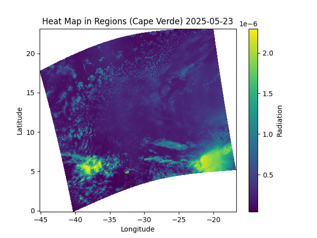

# 🌍 NASA – Atmospheric Radiation Analysis

On **May 25, 2025**, satellite data captured visualizations of Earth's atmospheric radiation — specifically over the **Cape Verde region** — with the goal of enhancing understanding and supporting research.

This project analyzes and visualizes solar radiation using satellite data to explore how radiation varies across different spectral bands and regions of the Earth.

---

## Heat Map Analysis

  

This section is intended to present spatial variations in atmospheric radiation, highlighting regions with higher or lower intensity using satellite-captured data.

---

## Solar Radiation Analysis Using Satellite Data

  

Imagine using a special NASA satellite equipped with a super-camera that sees the Earth through **497 magical lenses** — each one detecting a different type of light, from heat to moisture, vegetation, or even smoke — far beyond what human eyes can perceive.

These lenses are called **spectral bands**, and the data they collect is stored in a **3D data cube**: every layer shows how much light (or radiation) is detected at a specific wavelength across Earth’s surface.

By averaging the radiation across all locations and bands, we can visualize how the Earth "glows" in different parts of the spectrum — revealing atmospheric and surface patterns otherwise invisible.

---

## Average Distribution of Solar Radiation

  

This **radial (polar) chart** shows the average solar radiation detected across all spectral bands:

- Each **angle** represents a different spectral band (i.e., a specific light wavelength).
- The **distance from the center** indicates the average radiation intensity in that band.

This visualization helps identify which parts of the light spectrum receive more or less solar energy — crucial for climate analysis, Earth observation studies, and evaluating sensor performance.

---

## 📚 License & Attribution

This project uses public NASA satellite data. For educational and research purposes only.  
[View the dataset on NASA Earthdata](https://search.earthdata.nasa.gov/search/granules?p=C3412185476-GES_DISC&pg[0][v]=f&pg[0][gsk]=-start_date&g=G3544527571-GES_DISC&q=S5P_L1B_RA_BD5_HiR_NRT_2&tl=1742971109.7!3!!&lat=22.153508254183492&long=11.77673128553613&zoom=2.248078171956754)

---

Developed as part of a data visualization study on atmospheric radiation.
